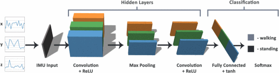
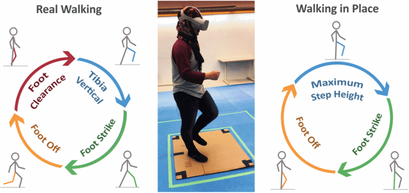
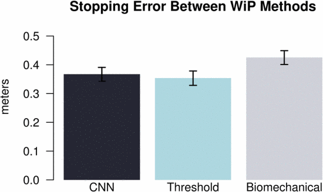

# Translating Walk in Place to Forward Motion in VR

### Project Goal
Virtual travel is one of the fundamental interactions in XR. However, the physical space is often smaller than the virtual space, breaking user immersion.
- People unconsciously exhibit many other motions when walking
    - Head bobs
    - Arm swings
    - Blinks
    - etc
- Can we measure these biomechanics to accurately predict walking speed on a treadmill and translate them into realistic virtual locomotion?

### Motivation
- Alternative locomotion methods (controllers, teleportation, lean-directed steering) impose a higher cognitive load than regular walking
- Consider fitness apps - how can we make the user feel as if they are actually walking or running in the real world when they are on a treadmill?
- Full body tracking is expensive and inconvenient
- We have yet to see a commercially viable solution that is able to replicate the experience of real walking within a limited physical space

### Challenges
- Biggest hurdle is that we are limited to headset and controllers. Without access to leg tracking, how can accurately can we predict how fast the user is walking?
- Non-trivial conversion of biomechanics (head tracking and controller tracking) to walking speed

### Current State of the Art
- On the Usability of Consumer Locomotion Techniques in Serious Games: Comparing Arm Swinging, Treadmills and Walk-in-Place [(Calandra et al., 2019)](https://ieeexplore.ieee.org/abstract/document/8966165)
    - Compares arm swinging, the KATWalk treadmill and the walk-in-place
    - Arm swinging resulted as significantly better in terms of easiness than KAT
- Improving Walking in Place Methods with Individualization and Deep Networks [(Hanson et al., 2019)](https://ieeexplore.ieee.org/abstract/document/8797751)
    - Used precise head motions to detect virtual step gaits 
    - Found that a trained convolutional neural network can be an effective way of implementing walking in place in terms of judged distance to actual distance 
    - Very similar to what we are trying to do but without treadmill

### Methodology
- Generate a virtual environment with a long straight path
- Collect walking data for different speeds
    - head positions
    - left and right controller positions
- Feed data into a convolutional neural network (or any supervised machine learning model) and train the model
- Run the model in VR to simulate forward walking
- Collect metrics comparing predicted velocities to actual velocities

### Timeline
Midpoint - 4/19/24
- Create a mock environment that renders in headset
- Begin data collection on treadmill
- Have a crude algorithm that calculates speed based on given data

Final - 5/10/24
- Collect all the necessary data
- Finished training the velocity prediction model
- Have a working prototype with demonstration of program adapting to different walking speeds

### Future Work
- User studies on how accurate the predicted velocities are and the amount of motion sickness they experience
- Can leg tracking, heart rate monitors, and breath tracking further improve accuracy?
- Allow user to interact with environment while walking
- Extend the scope
    - support turns
    - handle both walking and running - should they be handled differently?
    - adapt to different users
    - work on bicycles or other machines
